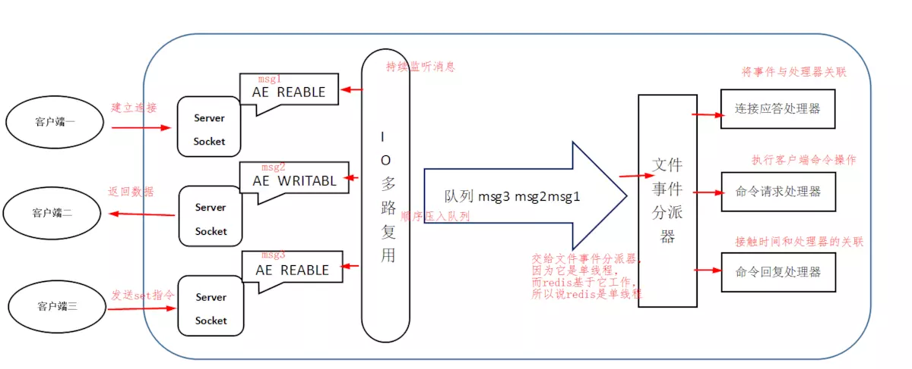

## [redis的线程模型](https://www.jianshu.com/p/0712771984e0)

https://www.jianshu.com/p/0712771984e0  
https://www.jianshu.com/p/6264fa82ac33   

## Redis是什么
Redis是C语言开发的一个开源的（遵从BSD协议）高性能键值对（key-value）的内存数据库，可以用作数据库、缓存、消息中间件等。
它是一种NoSQL（not-only sql，泛指非关系型数据库）的数据库。Redis作为一个内存数据库。  
1、性能优秀，数据在内存中，读写速度非常快，支持并发10W QPS；    
2、单进程单线程，是线程安全的，采用IO多路复用机制；    
3、丰富的数据类型，支持字符串（strings）、散列（hashes）、列表（lists）、集合（sets）、有序集合（sorted sets）等；  
4、支持数据持久化。可以将内存中数据保存在磁盘中，重启时加载；    
5、主从复制，哨兵，高可用；    
6、可以用作分布式锁；    
7、可以作为消息中间件使用，支持发布订阅.  

## redis五种数据类型
1、string是redis最基本的类型，可以理解成与memcached一模一样的类型，一个key对应一个value。value不仅是string，也可以是数字。  
    string类型是二进制安全的，意思是redis的string类型可以包含任何数据，比如jpg图片或者序列化的对象。string类型的值最大能存储512M。  
2、Hash是一个键值（key-value）的集合。redis的hash是一个string的key和value的映射表，Hash特别适合存储对象。常用命令：hget,hset,hgetall等。  
3、list列表是简单的字符串列表，按照插入顺序排序。可以添加一个元素到列表的头部（左边）或者尾部（右边）    
常用命令：lpush、rpush、lpop、rpop、lrange(获取列表片段)等。  
应用场景：list应用场景非常多，也是Redis最重要的数据结构之一，比如twitter的关注列表，粉丝列表都可以用list结构来实现。  
数据结构：list就是链表，可以用来当消息队列用。redis提供了List的push和pop操作，还提供了操作某一段的api，可以直接查询或者删除某一段的元素。  
实现方式：redis list的是实现是一个双向链表，既可以支持反向查找和遍历，更方便操作，不过带来了额外的内存开销。  
4、set是string类型的无序集合。集合是通过hashtable实现的。set中的元素是没有顺序的，而且是没有重复的。    
常用命令：sdd、spop、smembers、sunion等。  
应用场景：redis set对外提供的功能和list一样是一个列表，特殊之处在于set是自动去重的，而且set提供了判断某个成员是否在一个set集合中。  
5、zset和set一样是string类型元素的集合，且不允许重复的元素。常用命令：zadd、zrange、zrem、zcard等。    
使用场景：sorted set可以通过用户额外提供一个优先级（score）的参数来为成员排序，并且是插入有序的，即自动排序。  
        当你需要一个有序的并且不重复的集合列表，那么可以选择sorted set结构。和set相比，sorted set关联了一个double类型权重的参数score，  
        使得集合中的元素能够按照score进行有序排列，redis正是通过分数来为集合中的成员进行从小到大的排序。  
实现方式：Redis sorted set的内部使用HashMap和跳跃表(skipList)来保证数据的存储和有序，HashMap里放的是成员到score的映射，
        而跳跃表里存放的是所有的成员，排序依据是HashMap里存的score，使用跳跃表的结构可以获得比较高的查找效率，并且在实现上比较简单。  

## 数据类型应用场景总结
| 类型 | 简介 | 特性 | 场景 |
| :---:| :------: | :------: | :------: |
|string（字符串） | 二进制安全	 | 可以包含任何数据，比如jpg图片或者序列化对象	 | -- | 
|hash（字典）| 键值对集合，即编程语言中的map类型 | 适合存储对象，并且可以像数据库中的update一个属性一样只修改某一项属性值 | 存储、读取、修改用户属性 | 
|list（列表）| 链表（双向链表） | 增删快，提供了操作某一元素的api|最新消息排行；消息队列|
|set（集合）|hash表实现，元素不重复|添加、删除、查找的复杂度都是O(1)，提供了求交集、并集、差集的操作|共同好友；利用唯一性，统计访问网站的所有Ip|
|sorted set（有序集合）|将set中的元素增加一个权重参数score，元素按score有序排列|数据插入集合时，已经进行了天然排序|排行榜；带权重的消息队列|

## 如何使用redis做缓存？
一般有两种方式，一种是直接通过RedisTemplate来使用。
另一种是使用spring cache集成Redis（也就是注解的方式）
缓存注解
1、@Cacheable
根据方法的请求参数对其结果进行缓存
key：缓存的key，可以为空，如果指定要按照SPEL表达式编写，如果不指定，则按照方法的所有参数进行组合。
value：缓存的名称，必须指定至少一个（如 @Cacheable (value='user')或者@Cacheable(value={'user1','user2'})）
condition：缓存的条件，可以为空，使用SPEL编写，返回true或者false，只有为true才进行缓存。
2、@CachePut
根据方法的请求参数对其结果进行缓存，和@Cacheable不同的是，它每次都会触发真实方法的调用。参数描述见上。
3、@CacheEvict
根据条件对缓存进行清空
key：同上
value：同上
condition：同上
allEntries：是否清空所有缓存内容，缺省为false，如果指定为true，则方法调用后将立即清空所有缓存
beforeInvocation：是否在方法执行前就清空，缺省为false，如果指定为true，则在方法还没有执行的时候就清空缓存。缺省情况下，如果方法执行抛出异常，则不会清空缓存。  

## 缓存问题
* 缓存雪崩
缓存雪崩我们可以简单的理解为：由于原有缓存失效，新缓存未到期间所有原本应该访问缓存的请求都
去查询数据库了，而对数据库 CPU 和内存造成巨大压力，严重的会造成数据库宕机。从而形成一系列
连锁反应，造成整个系统崩溃。一般有三种处理办法：
1.  一般并发量不是特别多的时候，使用最多的解决方案是加锁排队。  
2.  给每一个缓存数据增加相应的缓存标记，记录缓存的是否失效，如果缓存标记失效，则更新数据缓存。  
3.  为 key 设置不同的缓存失效时间。  
>通常使用第3种解决方案处理缓存雪崩，在往Redis存数据的时候，把每个Key的失效时间都加个随机值就好了，这样可以保证数据不会再同一时间大面积失效。

* 缓存穿透
缓存穿透是指用户查询数据，在数据库没有，自然在缓存中也不会有。这样就导致用户查询的时候，在
缓存中找不到，每次都要去数据库再查询一遍，然后返回空（相当于进行了两次无用的查询）。这样请
求就绕过缓存直接查数据库，这也是经常提的缓存命中率问题。
1. 使用布隆过滤器（Bloom Filter），能很好的预防缓存穿透的发生，他的原理也很简单，就是利用高效的数据结构和算法快速判断出你这个Key是否在数据库中存在，不存在你return就好了，存在你就去查DB刷新KV再return。
2. 另外也有一个更为简单粗暴的方法，如果一个查询返回的数据为空（不管是数据不存在，还是系统故障），我们仍然把这个空结果进行缓存，但它的过期时间会很短，最长不超过五分钟。
  通过这个直接设置的默认值存放到缓存，这样第二次到缓冲中获取就有值了，而不会继续访问数据库。
  
## 缓存预热
缓存预热就是系统上线后，将相关的缓存数据直接加载到缓存系统。这样就可以避免在用户请求的时候，
先查询数据库，然后再将数据缓存的问题！用户直接查询事先被预热的缓存数据.

## 缓存更新
缓存更新除了缓存服务器自带的缓存失效策略之外（Redis 默认的有 6 中策略可供选择），我们还可以
根据具体的业务需求进行自定义的缓存淘汰，常见的策略有两种：
（1）定时去清理过期的缓存；
（2）当有用户请求过来时，再判断这个请求所用到的缓存是否过期，过期的话就去底层系统得到新数据并更新缓存。

## 缓存降级
当访问量剧增、服务出现问题（如响应时间慢或不响应）或非核心服务影响到核心流程的性能时，仍然
需要保证服务还是可用的，即使是有损服务。系统可以根据一些关键数据进行自动降级，也可以配置开
关实现人工降级。降级的最终目的是保证核心服务可用，即使是有损的。而且有些服务是无法降级的（如加入购物车、结算）。

## Redis为何这么快，聊聊Redis的线程模型
您是想问Redis这么快，为什么还是单线程的吧。Redis确实是单进程单线程的模型，因为Redis完全是基于内存的操作，CPU不是Redis的瓶颈，Redis的瓶颈最有可能是机器内存的大小或者网络带宽。  
既然单线程容易实现，而且CPU不会成为瓶颈，那就顺理成章的采用单线程的方案了（毕竟采用多线程会有很多麻烦）。  
第一：Redis完全基于内存，绝大部分请求是纯粹的内存操作，非常迅速，数据存在内存中，类似于HashMap，HashMap的优势就是查找和操作的时间复杂度是O(1)。  
第二：数据结构简单5中数据结构，对数据操作也简单。  
第三：采用单线程，避免了不必要的上下文切换和竞争条件，不存在多线程导致的CPU切换，不用去考虑各种锁的问题，不存在加锁释放锁操作，没有死锁问题导致的性能消耗。  
第四：基于NIO多路复用IO模型，底层源码中对epoll方法的支持，以及epoll_wait()阻塞方法决定它是单线程。  

## Redis和Memcached的区别
1、存储方式上：memcache会把数据全部存在内存之中，断电后会挂掉，数据不能超过内存大小。redis有部分数据存在硬盘上，这样能保证数据的持久性。  
2、数据支持类型上：memcache对数据类型的支持简单，只支持简单的key-value，，而redis支持五种数据类型。  
3、使用底层模型不同：它们之间底层实现方式以及与客户端之间通信的应用协议不一样。redis直接自己构建了VM机制，因为一般的系统调用系统函数的话，会浪费一定的时间去移动和请求。  
4、value的大小：redis可以达到1GB，而memcache只有1MB。  

## Redis的六种淘汰策略
| 策略 | 描述 |
|:----:|:---:|
|volatile-lru|从已设置过期时间的KV集中优先对最近最少使用(less recently used)的数据淘汰|
|volitile-ttl|从已设置过期时间的KV集中优先对剩余时间短(time to live)的数据淘汰|
|volitile-random|从已设置过期时间的KV集中随机选择数据淘汰|
|allkeys-lru|从所有KV集中优先对最近最少使用(less recently used)的数据淘汰|
|allKeys-random|从所有KV集中随机选择数据淘汰|
|noeviction|不淘汰策略，若超过最大内存，返回错误信息|

Redis4.0加入了LFU(least frequency use)淘汰策略，包括volatile-lfu和allkeys-lfu，通过统计访问频率，将访问频率最少，即最不经常使用的KV淘汰。

## Redis持久化
Redis的持久化策略有两种：  
1、RDB：快照形式是直接把内存中的数据保存到一个dump的文件中，定时保存，保存策略。  
2、AOF：把所有的对Redis的服务器进行修改的命令都存到一个文件里，命令的集合。Redis默认是快照RDB的持久化方式。  
当Redis重启的时候，它会优先使用AOF文件来还原数据集，因为AOF文件保存的数据集通常比RDB文件所保存的数据集更完整。你甚至可以关闭持久化功能，让数据只在服务器运行时存。

## Redis持久化RDB
默认Redis是会以快照"RDB"的形式将数据持久化到磁盘的一个二进制文件dump.rdb。工作原理简单说一下：当Redis需要做持久化时，Redis会fork一个子进程，子进程将数据写到磁盘上一个临时RDB文件中。当子进程完成写临时文件后，将原来的RDB替换掉，这样的好处是可以copy-on-write。
有点：RDB的优点是：这种文件非常适合用于备份：比如，你可以在最近的24小时内，每小时备份一次，并且在每个月的每一天也备份一个RDB文件。这样的话，即使遇上问题，也可以随时将数据集还原到不同的版本。RDB非常适合灾难恢复。RDB的缺点是：如果你需要尽量避免在服务器故障时丢失数据，那么RDB不合适你。

## Redis持久化AOF
使用AOF做持久化，每一个写命令都通过write函数追加到appendonly.aof中，配置方式如下:  
~~~
appendfsync yes   
appendfsync always     #每次有数据修改发生时都会写入AOF文件。
appendfsync everysec   #每秒钟同步一次，该策略为AOF的缺省策略。
~~~
AOF可以做到全程持久化，只需要在配置中开启 appendonly yes。这样redis每执行一个修改数据的命令，都会把它添加到AOF文件中，当redis重启时，将会读取AOF文件进行重放，恢复到redis关闭前的最后时刻。

## 如何选用Redis持久化策略
如果你非常关心你的数据，但仍然可以承受数分钟内的数据丢失，那么可以额只使用RDB持久。AOF将Redis执行的每一条命令追加到磁盘中，处理巨大的写入会降低Redis的性能，不知道你是否可以接受。  
数据库备份和灾难恢复：定时生成RDB快照非常便于进行数据库备份，并且RDB恢复数据集的速度也要比AOF恢复的速度快。当然了，redis支持同时开启RDB和AOF，系统重启后，redis会优先使用AOF来恢复数据，这样丢失的数据会最少。

## 主从复制
主从配置结合哨兵模式能解决单点故障问题，提高redis可用性。从节点仅提供读操作，主节点提供写操作。  
对于读多写少的状况，可给主节点配置多个从节点，从而提高响应效率。  
关于复制过程，是这样的：  
1、从节点执行slaveof[masterIP][masterPort]，保存主节点信息。  
2、从节点中的定时任务发现主节点信息，建立和主节点的socket连接。   
3、从节点发送Ping信号，主节点返回Pong，两边能互相通信。  
4、连接建立后，主节点将所有数据发送给从节点（数据同步）。  
5、主节点把当前的数据同步给从节点后，便完成了复制的建立过程。接下来，主节点就会持续的把写命令发送给从节点，保证主从数据一致性。

## 主从复制会存在哪些问题
主从复制会存在以下问题：  
1、一旦主节点宕机，从节点晋升为主节点，同时需要修改应用方的主节点地址，还需要命令所有从节点去复制新的主节点，整个过程需要人工干预。  
2、主节点的写能力受到单机的限制。  
3、主节点的存储能力受到单机的限制。  
4、原生复制的弊端在早期的版本中也会比较突出，比如：redis复制中断后，从节点会发起psync。此时如果同步不成功，则会进行全量同步，主库执行全量备份的同时，可能会造成毫秒或秒级的卡顿。  

## 解决主从复制的主流方案
* 使用哨兵模式  

Redis Sentinel（哨兵）主要功能包括主节点存活检测、主从运行情况检测、自动故障转移、主从切换。Redis Sentinel最小配置是一主一从。  
Redis的Sentinel系统可以用来管理多个Redis服务器，该系统可以执行以下四个任务：  
1、监控：不断检查主服务器和从服务器是否正常运行。  
2、通知：当被监控的某个redis服务器出现问题，Sentinel通过API脚本向管理员或者其他应用程序发出通知。  
3、自动故障转移：当主节点不能正常工作时，Sentinel会开始一次自动的故障转移操作，它会将与失效主节点是主从关系的其中一个从节点升级为新的主节点，并且将其他的从节点指向新的主节点，这样人工干预就可以免了。  
4、配置提供者：在Redis Sentinel模式下，客户端应用在初始化时连接的是Sentinel节点集合，从中获取主节点的信息。  

## 哨兵模式的工作原理
1、每个Sentinel节点都需要定期执行以下任务：每个Sentinel以每秒一次的频率，向它所知的主服务器、从服务器以及其他的Sentinel实例发送一个PING命令。  
2、如果一个实例距离最后一次有效回复PING命令的时间超过down-after-milliseconds所指定的值，那么这个实例会被Sentinel标记为主观下线。  
3、如果一个主服务器被标记为主观下线，那么正在监视这个服务器的所有Sentinel节点，要以每秒一次的频率确认主服务器的确进入了主观下线状态。  
4、如果一个主服务器被标记为主观下线，并且有足够数量的Sentinel（至少要达到配置文件指定的数量）在指定的时间范围内同意这一判断，那么这个主服务器被标记为客观下线。  
5、一般情况下，每个Sentinel会以每10秒一次的频率向它已知的所有主服务器和从服务器发送INFO命令，当一个主服务器被标记为客观下线时，Sentinel向下线主服务器的所有从服务器发送INFO命令的频率，会从10秒一次改为每秒一次。  
6、Sentinel和其他Sentinel协商客观下线的主节点的状态，如果处于SDOWN状态，则投票自动选出新的主节点，将剩余从节点指向新的主节点进行数据复制。  
7、当没有足够数量的Sentinel同意主服务器下线时，主服务器的客观下线状态就会被移除。当主服务器重新向Sentinel的PING命令返回有效回复时，主服务器的主观下线状态就会被移除。  

## 完结散花

